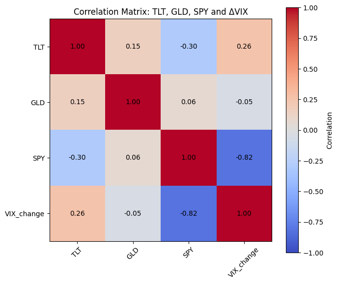
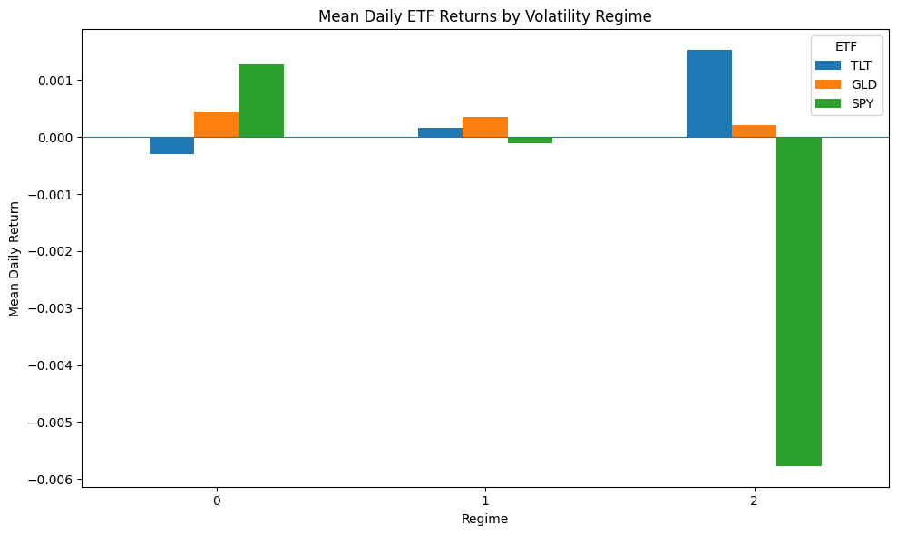
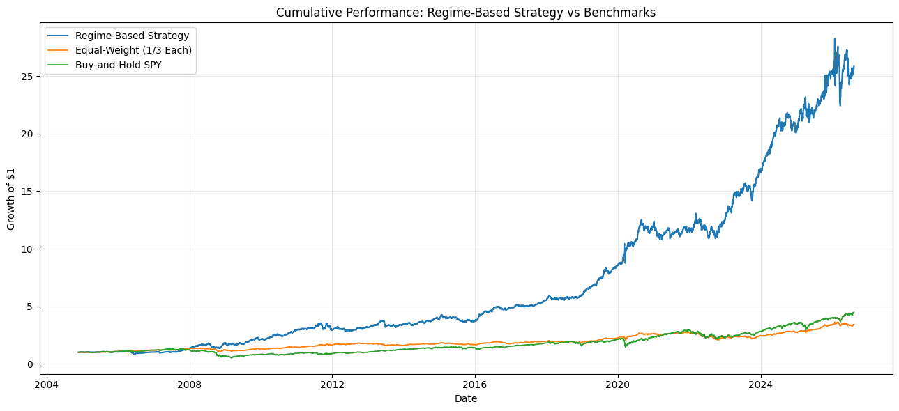
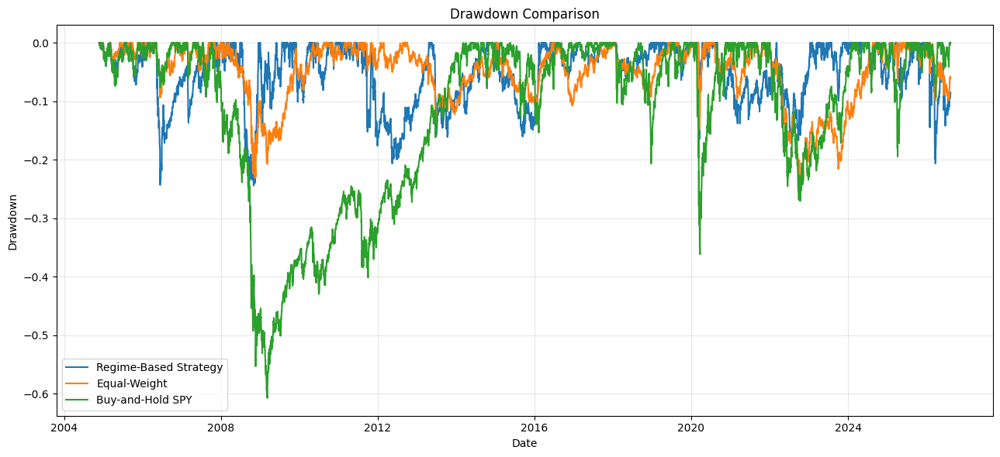

# VIX Regime-Based Asset Allocation

A quantitative finance project exploring whether market volatility regimes identified from the VIX can be used to guide allocation between US equities, gold and long-term US Treasuries.

## Overview

This project develops and evaluates a regime-based asset allocation strategy using the VIX as an indicator of market volatility.

The analysis compares two approaches to regime detection:

- Discrete Markov chains using quantile-based volatility states
- Gaussian Hidden Markov Models (HMMs) estimated using the Expectation-Maximisation (EM) algorithm

The identified regimes are then used to allocate between:

- SPY — S&P 500
- GLD — Gold
- TLT — Long-term US Treasuries

The strategy is evaluated through historical backtesting and compared with an equal-weight portfolio and a buy-and-hold SPY strategy.

## Project Objectives

1. Identify distinct volatility regimes using VIX data.
2. Compare discrete Markov chains with Gaussian Hidden Markov Models.
3. Determine an appropriate number of hidden states using log-likelihood, AIC and BIC.
4. Develop a regime-based asset allocation strategy.
5. Evaluate the strategy using historical performance and risk measures.

## Methodology

### 1. Data Preparation

The analysis uses daily observations of the VIX, SPY, GLD and TLT.

The dataset contains approximately 20 years of market observations.

### Correlation Matrix

### 2. Markov Chain Regime Detection

Daily changes in the VIX are classified into low, medium and high volatility states using quantile-based thresholds.

A transition matrix is then estimated to examine how volatility states evolve over time.

### 3. Hidden Markov Model

Gaussian Hidden Markov Models are fitted using the Expectation-Maximisation algorithm.

Both two-state and three-state specifications are considered.

Model selection is based on:

- Log-likelihood
- Akaike Information Criterion (AIC)
- Bayesian Information Criterion (BIC)

The three-state HMM provides the stronger specification for the analysis.

### 4. Regime-Based Allocation

The identified volatility regimes are mapped to different asset allocations:

| Regime | Allocation |
|---|---|
| Low volatility | SPY |
| Medium volatility | GLD |
| High volatility | TLT |

### 5. Backtesting

The resulting strategy is evaluated against:

- Equal-weight portfolio
- Buy-and-hold SPY

Performance is assessed using:

- Annualised return
- Annualised volatility
- Sharpe ratio
- Maximum drawdown
- Cumulative returns

### Mean Returns by Regime

## Results

The regime-based strategy produced the following historical performance in the analysis:

| Strategy | Annualised Return | Volatility | Sharpe Ratio | Maximum Drawdown |
|---|---:|---:|---:|---:|
| Regime-Based | 17.44% | 15.51% | 1.12 | -24.45% |
| Equal Weight | 7.67% | 9.81% | 0.78 | -23.99% |
| Buy & Hold SPY | 9.15% | 18.89% | 0.48 | -59.58% |

### Cumulative Performance

The HMM identified persistent changes in volatility conditions and captured major periods of market stress, including the 2008 financial crisis and the 2020 COVID-19 market shock.

### Drawdown Comparison

## Key Takeaway

One of the main lessons from the project is that the choice of regime-detection method matters.

The quantile-based Markov chain tended to produce less persistent states because it classified changes in volatility using fixed thresholds. The HMM, in contrast, was able to infer underlying states from the observed data and produced more persistent and interpretable regimes.

The results suggest that stochastic modelling can provide a useful framework for understanding changing market conditions and constructing systematic allocation strategies.

## Notebook

The complete analysis is available in:

`VIX_Regime_Based_Allocation.ipynb`

## Data

The analysis uses daily market data for SPY, GLD, TLT and the VIX.

The data was obtained from Yahoo Finance and covers the period from November 2004 to August 2026.

The dataset was used for educational and research purposes as part of the stochastic modelling project.

For reproducibility, the notebook is structured around a local `DATA.csv` input file rather than distributing the downloaded dataset with the repository.

## Tools

Python · pandas · NumPy · matplotlib · scikit-learn · hmmlearn · Jupyter

## Disclaimer

This project is for educational and research purposes only. Historical backtested performance does not guarantee future results and should not be interpreted as financial advice.
